# AI Trader Bot — Architecture & Design

A comprehensive overview of the system for technical and non-technical audiences.

---

## What It Does

An AI-powered forex trading bot that scans 10 currency pairs every 3 hours, uses 14 data sources and a neural network to make trade decisions, and manages risk automatically. Controlled via Telegram and a web dashboard.

---

## System Overview

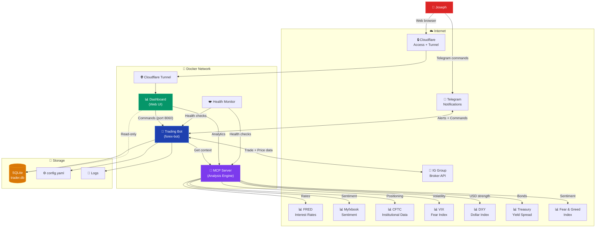

---

## How a Trade Decision is Made

Every 3 hours, the bot evaluates each currency pair through this pipeline:

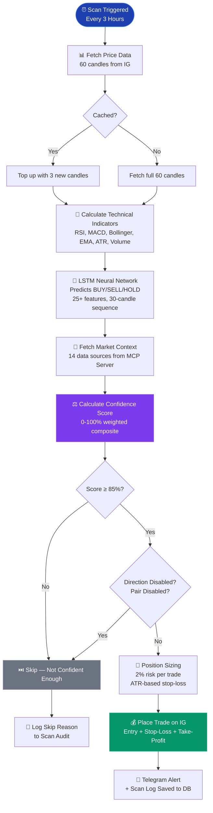

---

## Confidence Score Breakdown

The confidence score determines whether a trade happens. It's built from multiple independent signals:

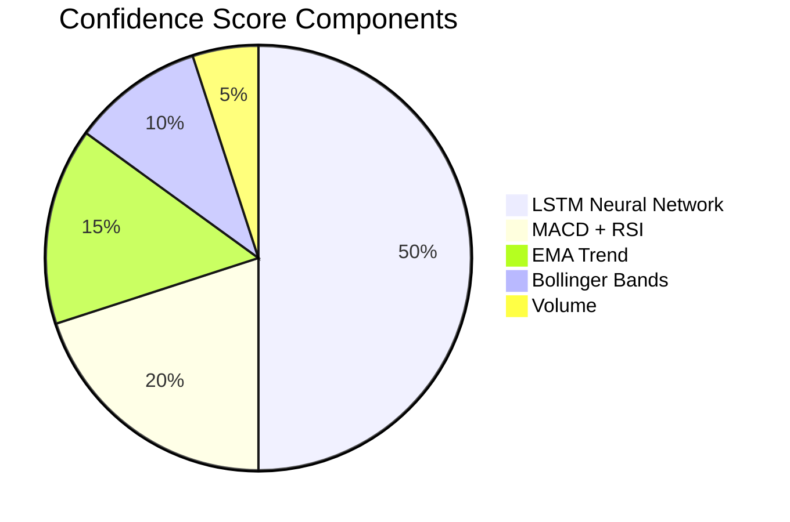

After the base score, **14 MCP context signals** adjust it up or down:

```mermaid
graph LR
    subgraph Boost["🟢 Boost Signals (+points)"]
        A1["News aligned +8"]
        A2["IG contrarian +8"]
        A3["Myfxbook contrarian +5"]
        A4["FRED carry trade +5"]
        A5["COT institutional +5"]
        A6["Good session +5"]
        A7["Low volatility +5"]
        A8["VIX calm +3"]
        A9["DXY aligned +5"]
        A10["Yield spread aligned +3"]
        A11["Fear & Greed aligned +5"]
        A12["FinBERT sentiment +5"]
    end

    subgraph Penalty["🔴 Penalty Signals (-points)"]
        B1["High-impact news -15"]
        B2["Extreme volatility -15"]
        B3["News opposed -10"]
        B4["IG with crowd -10"]
        B5["Correlation risk -10"]
        B6["COT opposed -8"]
        B7["FRED against carry -5"]
        B8["Myfxbook crowd -5"]
        B9["Bad session -5"]
        B10["VIX spike -8"]
        B11["DXY opposed -5"]
        B12["Yield inversion -5"]
        B13["Fear & Greed extreme -5"]
        B14["FinBERT opposed -5"]
    end

    BASE["Base Score<br/>0-100%"] --> Boost --> FINAL
    BASE --> Penalty --> FINAL["Final Score<br/>Must be ≥ 85%"]

    style BASE fill:#1e40af,stroke:#3b82f6,color:#fff
    style FINAL fill:#059669,stroke:#10b981,color:#fff
```

---

## LSTM Neural Network

The AI brain that predicts market direction. Contributes 50% of the confidence score.

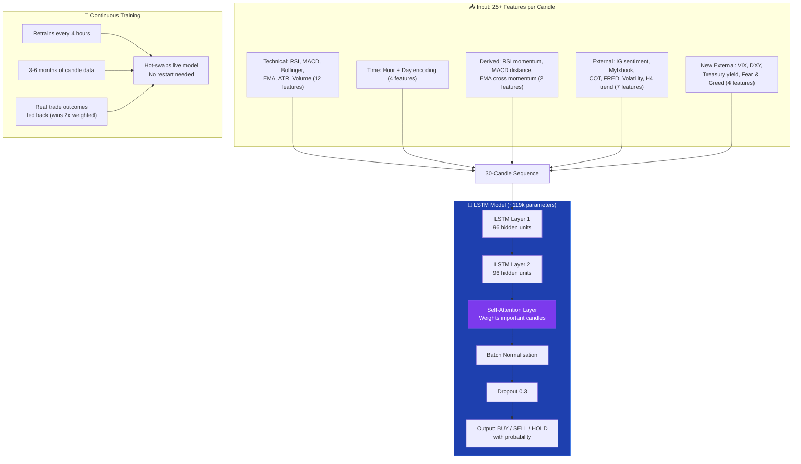

---

## Risk Management

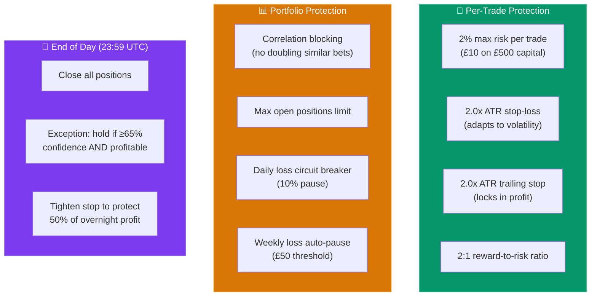

---

## Automated Remediation System

The bot monitors its own performance and fixes problems automatically:

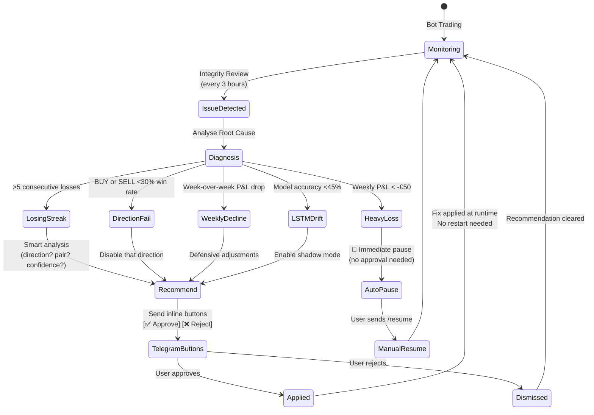

---

## Dashboard

Interactive web dashboard at `aitradefintech.com`, protected by Cloudflare Access (Google OAuth).

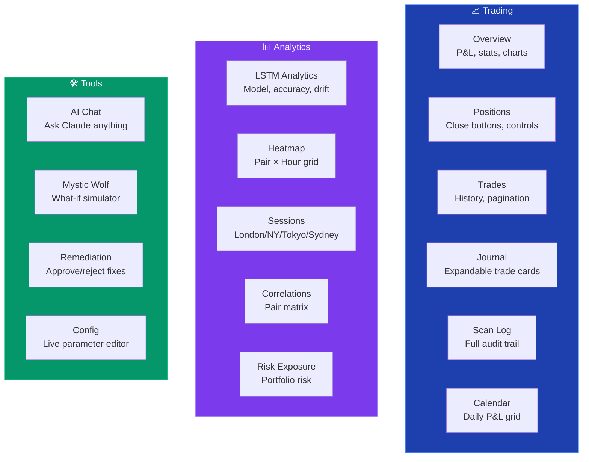

---

## Data Flow — Where Information Lives

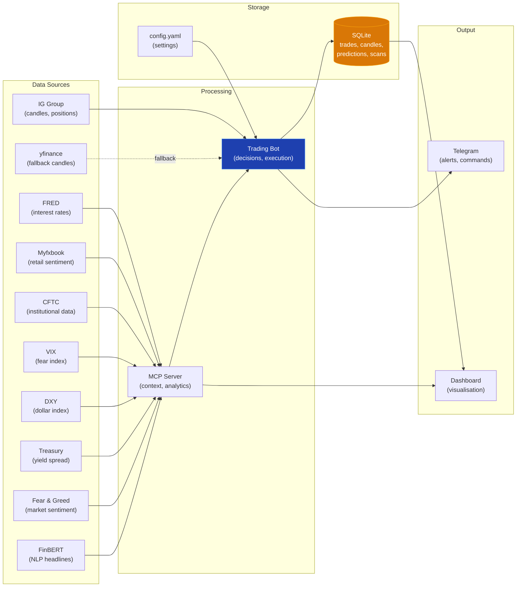

---

## Infrastructure

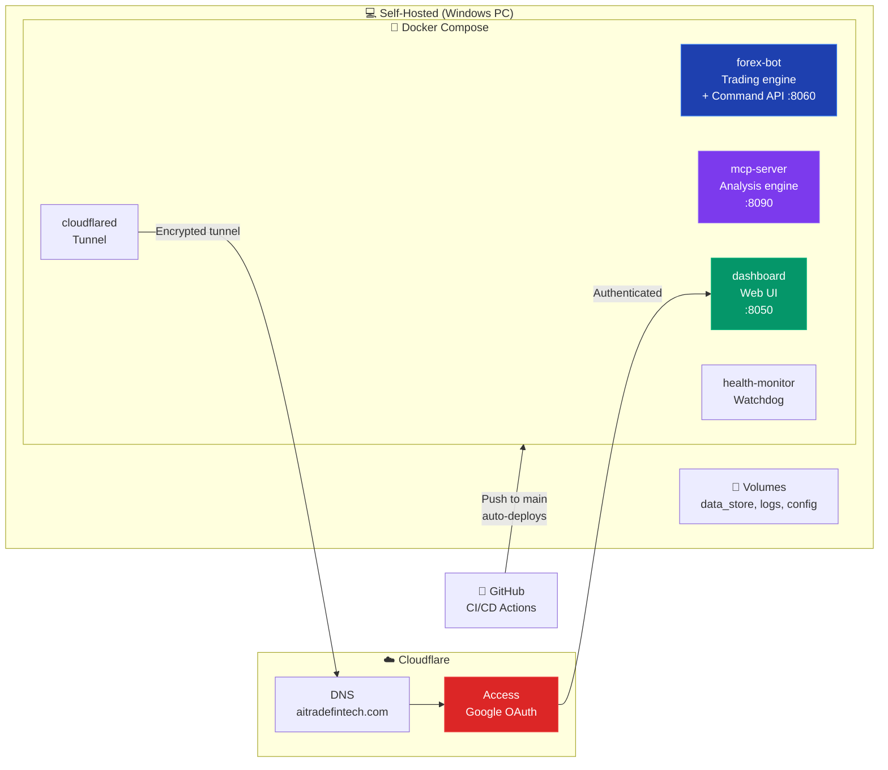

---

## Key Numbers

| Metric | Value |
|--------|-------|
| Currency pairs | 10 (EUR/USD, GBP/USD, USD/JPY, + 7 more) |
| Scan frequency | Every 3 hours |
| Confidence threshold | 85% minimum to trade |
| Data sources | 14 (LSTM, technicals, IG sentiment, Myfxbook, COT, FRED, VIX, DXY, Treasury yield, Fear & Greed, FinBERT NLP, calendar, volatility regime, session performance) |
| LSTM features | 25+ per candle (18 base + 7 external signals) |
| Daily profit target | £20 (bank and pause when hit) |
| Position reconciliation | Every 5 minutes |
| Health audit | Twice daily (09:00 + 17:00 UTC) |
| Integrity review | Every 3 hours (aligned with scans) |
| Deep review | Every 6 hours |
| Dashboard pages | 20 |
| Risk per trade | 2% of capital (£10 on £500) |
| Stop-loss | 2.0× ATR (adapts to volatility) |
| Reward:risk | 2:1 minimum |
| Capital | £500 (demo account) |
| Broker | IG Group (demo) |
| Dashboard | aitradefintech.com (Cloudflare Access protected) |
| Hosting | Self-hosted Docker on Windows |
| CI/CD | GitHub Actions → auto-deploy on push to main |

---

## Tech Stack

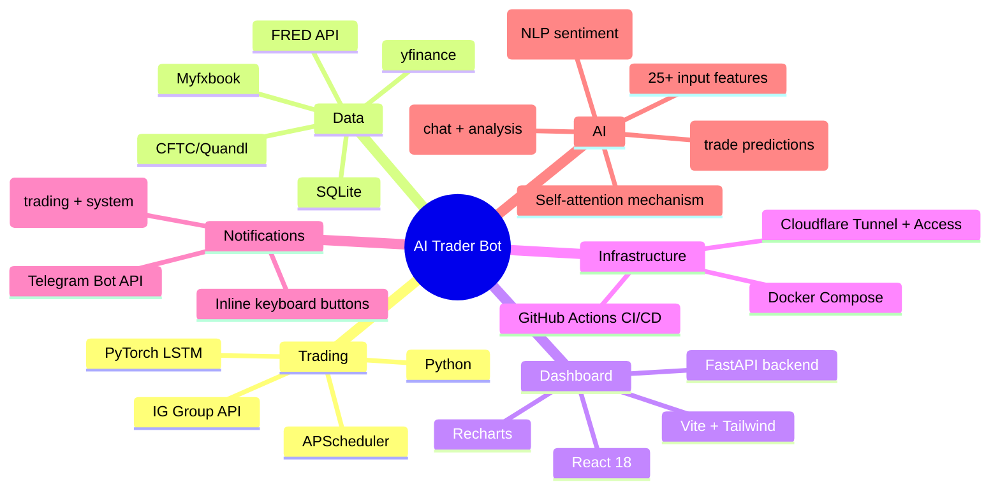

---

*Last updated: March 2026*
