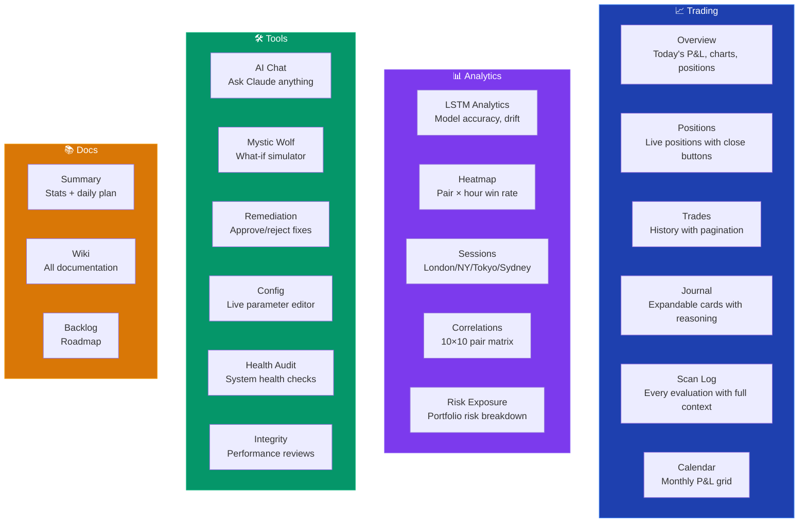
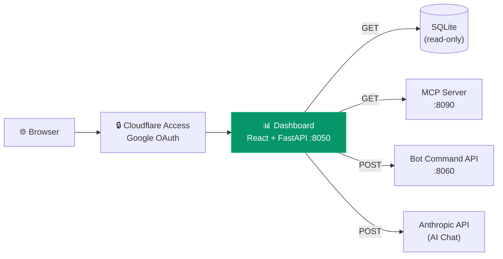

# Web Dashboard

Interactive trading dashboard at **aitradefintech.com**, protected by Cloudflare Access (Google OAuth).

---

## Pages

## Key Features

### Trade Controls
The Positions page includes a control bar:
- **Pause/Resume** — stop or restart trading instantly
- **Close All** — emergency close every position
- **Close Profitable/Losing** — selective closures
- **Per-position Close** buttons on each card
- **Disabled badges** — shows blocked directions/pairs with re-enable buttons

### AI Chat
Messenger-style interface with Claude. Every message gets live trading context injected:
- All daily P&L history
- Per-pair and per-direction performance
- Last 20 closed trades
- Open positions
- Bot status and config
- LSTM model info

Conversation persists across page navigation (stored in sessionStorage).

### Config Editor
Change 8 runtime parameters with sliders — takes effect immediately, persists to YAML:
- Min confidence to trade
- Risk per trade %
- Overnight hold threshold
- Stop-loss ATR multiplier
- Trailing stop activation/trail ATR
- Take-profit ratio
- LSTM shadow mode toggle

### Mystic Wolf (What-If Simulator)
Replays historical trades with hypothetical settings. Shows:
- Actual vs simulated P&L side-by-side
- Which trades would have been filtered and why
- Per-pair impact breakdown
- Filter reason counts

### Calendar
Monthly grid showing daily P&L at a glance. Each day shows:
- Net P&L (colour-coded green/red)
- Trade count, wins, losses, breakeven
- Month navigation with totals

## Architecture

### Health Audit
Scheduled twice daily (09:00 + 17:00 UTC). Checks:
- Bot and MCP server responsiveness
- IG API connectivity
- LSTM model age and accuracy
- Disk space and database size
- Open position reconciliation

Results displayed on the Health Audit page with status badges and historical trend.

### Integrity Reviews
Runs every 3 hours (aligned with market scans) plus a deep review every 6 hours. Analyses:
- Win rate trends by pair and direction
- P&L trajectory and drawdown levels
- LSTM prediction accuracy vs baseline
- Remediation recommendation history

## Tech Stack

- **Frontend**: React 18, Vite 5, Tailwind CSS 3, Recharts
- **Backend**: FastAPI (Python), serves API + built static files
- **Auth**: Cloudflare Access with Google OAuth
- **Hosting**: Docker container, Cloudflare Tunnel for HTTPS
