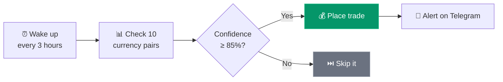
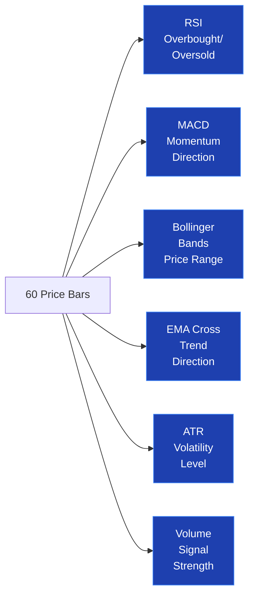
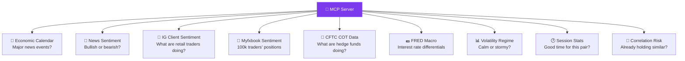
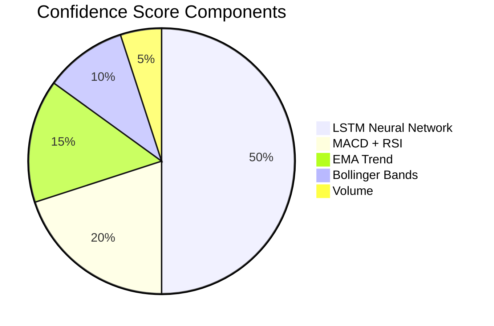
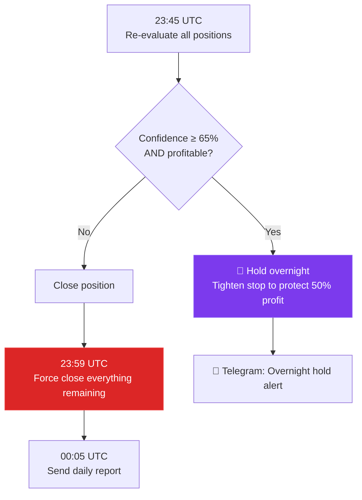
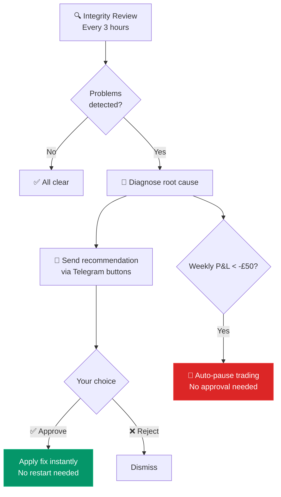
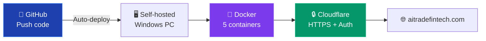

# How Joseph's Forex Bot Works
### A Plain-English Guide — No Jargon

---

## The Big Picture

Every 3 hours, the bot wakes up and asks the same question for each currency pair:

> *"Is there a good trading opportunity right now, and how confident am I?"*

If the answer is confident enough (85% or above), it places a trade.
If not, it does nothing and waits for the next scan.

Simple as that.

---

## Step by Step — What Happens Each Scan

### 1. Fetch Price Data
The bot asks IG Group: *"Give me the last 60 price bars for EUR/USD."*

A "price bar" contains the open, high, low, and close price for a 1-hour period.
60 bars = about 2.5 days of recent price history.

If IG is unavailable, the bot automatically falls back to Yahoo Finance as a free backup. You'll get a Telegram alert when this happens.

### 2. Calculate Technical Indicators
The bot runs the price data through several standard trading tools:

**RSI** — Like a rubber band. The more stretched the price gets, the more likely it snaps back.
**MACD** — Like a car's engine. Tells you whether momentum is accelerating or braking.
**Bollinger Bands** — Price bounces between walls. Touching the outer wall often means a reversal.
**EMA Crossover** — When the fast average crosses the slow one, the trend is shifting.
**ATR** — How much the price typically moves. Used to set stop-losses at a sensible distance.

### 3. Ask the AI Brain (LSTM Neural Network)
The bot has a real neural network that looks at the last 30 hours of data (25 features per hour) and predicts: **will the price go up, down, or sideways?**

This contributes **50% of the confidence score** — it's the single biggest input.

The LSTM retrains every 4 hours on fresh data, and it learns from the bot's actual trade results: winning patterns get reinforced, losing patterns get corrected.

### 4. Check the Market Context (9 Data Sources)
Before deciding, the bot consults its "research desk" — the MCP server:

### 5. Calculate the Confidence Score

All signals are combined into a single score: **0 to 100%**.

Then the 9 MCP context signals adjust it — boosting aligned signals, penalising conflicting ones. The bot **only trades if the final score is 85% or above**.

### 6. Size the Trade Safely
The rule: **risk only 2% of capital on any single trade** (£10 on £500).

- Stop-loss set at 2.0× ATR from entry (adapts to volatility)
- Take-profit set at 2:1 reward-to-risk ratio
- Position size calculated so hitting the stop-loss loses exactly 2%

### 7. Place the Trade & Notify
The bot places the trade on IG with a stop-loss and take-profit, then sends you a Telegram message with the full details and reasoning.

---

## End of Day (23:59 UTC)

---

## Self-Healing: Automated Remediation

The bot monitors its own performance and fixes problems without you needing to intervene:

---

## The Dashboard

A full web dashboard at **aitradefintech.com**, protected by Google login:

| Section | What you see |
|---------|-------------|
| **Overview** | Today's P&L, intraday chart, open positions |
| **Positions** | Live positions with close buttons |
| **Calendar** | Monthly grid — P&L per day at a glance |
| **Trade Journal** | Every trade with full reasoning and breakdown |
| **AI Chat** | Ask Claude anything about your trading |
| **Heatmap** | Which pairs work at which times |
| **Config** | Change settings with sliders — takes effect immediately |
| **Mystic Wolf** | "What if I had used different settings last week?" simulator |

---

## Infrastructure

Push code to GitHub → containers rebuild automatically → dashboard updates within 60 seconds. Zero manual deployment.

---

## Why This Isn't Just Pattern Matching

Traditional trading bots: "RSI below 30 = always buy." That's pattern matching. Works sometimes, fails catastrophically in others.

This bot is different:

1. **It understands context** — a buy signal during a major news event is completely different from the same signal on a quiet day
2. **9 independent data sources must agree** — no single indicator can trigger a trade
3. **The AI learns from its mistakes** — losing trades get fed back into the LSTM so it learns to avoid those setups
4. **It self-heals** — detects when a strategy stops working and recommends fixes
5. **It knows when to sit out** — at 85% confidence threshold, most scans result in doing nothing. Sitting on your hands when uncertain is one of the hardest things in trading.

---

*For the full technical architecture with detailed Mermaid diagrams, see [ARCHITECTURE.md](ARCHITECTURE.md).*
