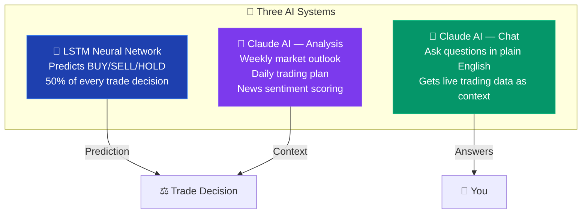
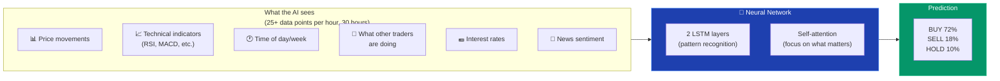
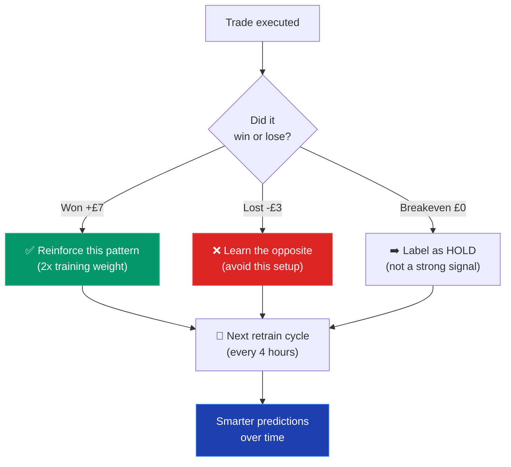
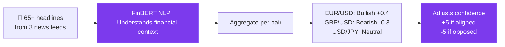
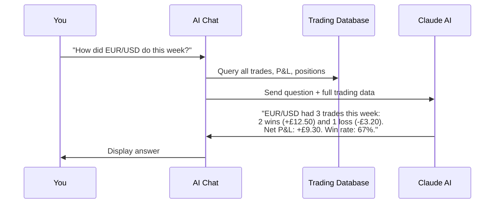
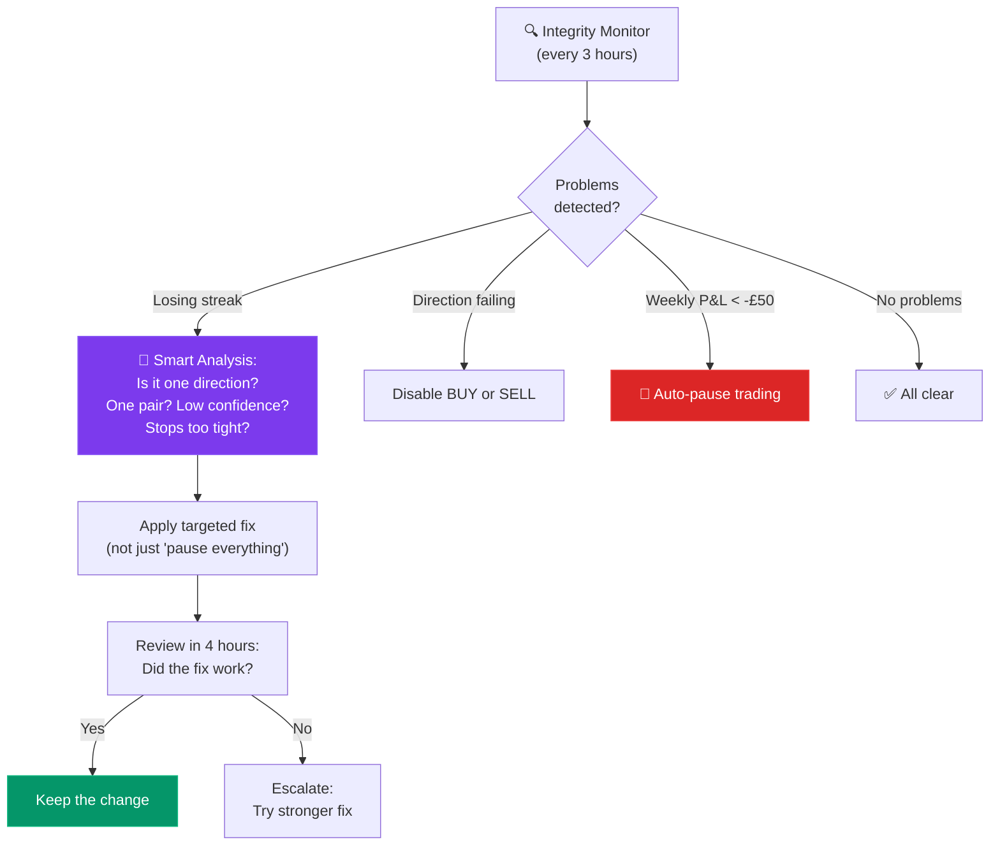
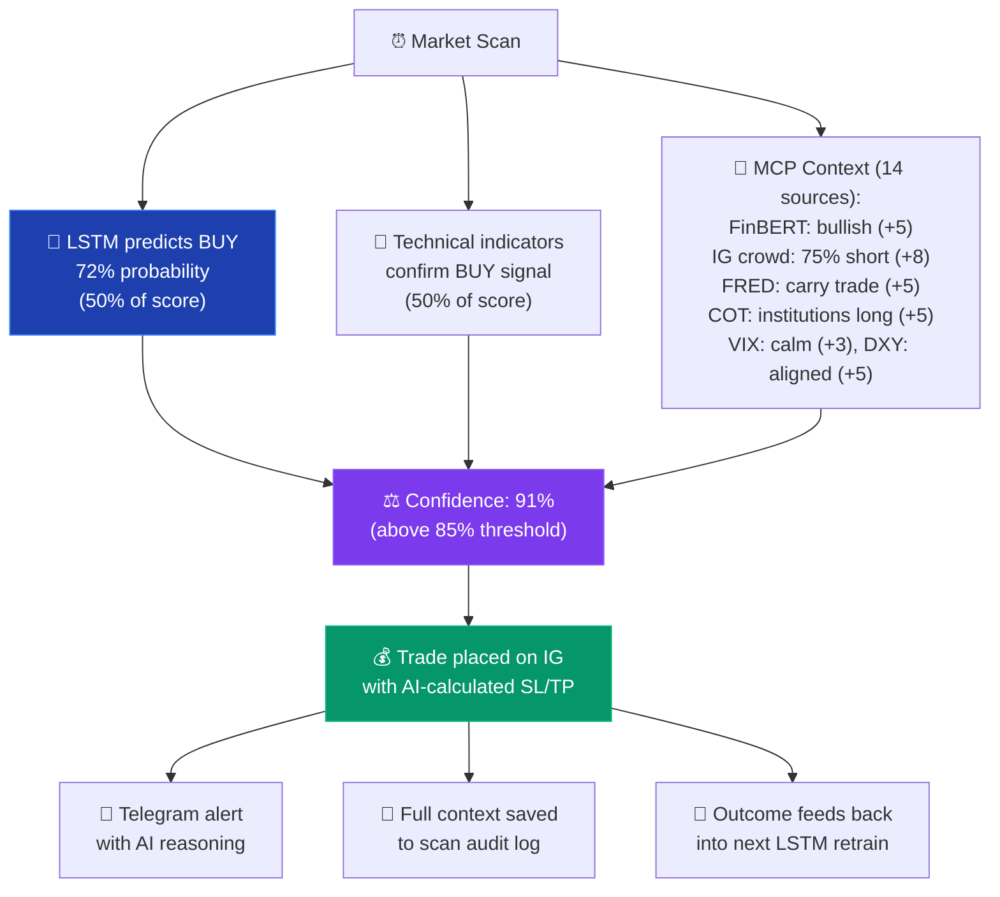

# How AI Is Used in the Trading Bot

This document explains how artificial intelligence is woven into every part of the trading system — from predicting market direction to monitoring its own performance.

---

## AI at a Glance

There are **three distinct AI systems** working together:

---

## 1. LSTM Neural Network — The Prediction Engine

**What it does:** Looks at the last 30 hours of market data and predicts whether the price will go **up (BUY)**, **down (SELL)**, or **sideways (HOLD)**.

**How it works in simple terms:**

Imagine you're trying to predict whether it will rain tomorrow. You'd look at the last few days of weather — temperature, humidity, wind, clouds. The LSTM does the same thing with price data — it looks at patterns in the recent past to predict what happens next.

### It learns from its mistakes

Every 4 hours, the LSTM retrains on fresh data. Crucially, it also learns from the bot's **actual trade results**:

### What makes this LSTM special

Most trading bots use simple rules: "If RSI < 30, buy." That's pattern matching — it works sometimes but fails in changing markets.

This LSTM is different because:
- It sees **25+ different signals simultaneously** (not just one indicator)
- It has a **self-attention mechanism** that can focus on the most important moment in the last 30 hours (e.g., a sudden spike 15 hours ago that's still relevant)
- It **learns from real outcomes** — winning trades reinforce the pattern, losing trades teach it to avoid similar setups
- It **retrains every 4 hours** — adapting to changing market conditions instead of using a static model

---

## 2. Claude AI — Market Analysis

Claude (by Anthropic) is used for tasks that require **reasoning and language understanding** — things a neural network can't do.

### Weekly Market Outlook

Every Sunday evening, Claude analyses:
- Upcoming economic events (central bank meetings, employment data, GDP)
- Current market themes (risk-on vs risk-off, geopolitical events)
- The bot's recent performance (what worked, what didn't)

It produces a plain-English outlook that gets sent to you via Telegram:

> *"EUR/USD likely to remain range-bound ahead of Wednesday's FOMC minutes. GBP pairs may see volatility from Tuesday's UK employment data. The bot performed well on JPY crosses last week — Tokyo session trades had 70% win rate. Consider maintaining current settings."*

### Daily Trading Plan

Each evening at 00:10 UTC, Claude generates a trading plan for the next day based on:
- Scheduled economic events
- Current technical setups across all 10 pairs
- The bot's recent performance patterns

### News Sentiment Scoring (FinBERT NLP)

The bot uses **FinBERT**, an open-source NLP model fine-tuned for financial text, to analyse news headlines from FX Street, ForexLive, and Investing.com. Unlike simple keyword matching, FinBERT understands context and nuance in financial language — it can tell the difference between "rates may rise" (hawkish) and "rates may rise less than expected" (dovish).

### Macro & Cross-Market Signals

Beyond news, the MCP server fetches broader market indicators that feed into both the LSTM features and the confidence modifiers:

- **VIX (Fear Index)** — measures market fear; spikes reduce confidence, calm markets boost it
- **DXY (Dollar Index)** — USD strength proxy; alignment with trade direction boosts confidence
- **Treasury Yield Spread (2Y/10Y)** — yield curve inversion signals recession risk
- **Fear & Greed Index** — extreme readings flag overbought/oversold market conditions

---

## 3. Claude AI — Conversational Chat

The dashboard and Telegram bot both have an AI chat interface where you can ask questions in plain English:

### What makes this powerful

Every message you send gets **live trading data injected** before Claude sees it:
- Every day's P&L since the bot started
- Per-pair and per-direction performance
- Last 20 closed trades with full details
- Current open positions
- Bot configuration (confidence, risk settings)
- LSTM model accuracy and status

This means Claude isn't guessing — it's **reasoning over your actual data**. Ask it:
- *"Why am I losing on SELL trades?"*
- *"Should I raise my confidence threshold?"*
- *"Compare this week to last week"*
- *"What's my best performing pair?"*

---

## 4. AI-Powered Self-Healing

The bot uses AI-informed logic to **monitor and fix its own performance**:

This isn't simple "if-then" rules — the system **diagnoses root causes**. If there's a losing streak, instead of blindly pausing, it asks:
- Are 70%+ of losses in one direction? → Disable that direction
- Are 60%+ of losses in one pair? → Remove that pair
- Are most losses hitting stop-loss? → Widen the stops
- Are most losses from end-of-day closes? → Lower the overnight threshold

---

## 5. AI in the Dashboard

### Mystic Wolf — What-If Simulator
Powered by database queries (not AI directly), but lets you test AI-informed hypotheses:

*"What if the confidence threshold had been 90% last week?"*

The simulator replays every trade and shows which would have been filtered out and how P&L would change.

### Heatmap & Session Analysis
The dashboard uses the AI's scan log data to show visual patterns — which pairs the AI trades successfully at which times of day, helping you understand when the AI performs best.

---

## How AI Decisions Flow Into a Trade

Putting it all together — here's every AI touchpoint in a single trade:

---

## Summary

| AI System | What It Does | How Often |
|-----------|-------------|-----------|
| **LSTM Neural Network** | Predicts market direction (BUY/SELL/HOLD) | Every scan (3 hours) |
| **LSTM Training** | Learns from new data + real trade outcomes | Every 4 hours |
| **Claude — Analysis** | Weekly outlook, daily plan, news sentiment | Daily + weekly |
| **Claude — Chat** | Answers your questions with live data context | On demand |
| **Self-Healing** | Detects problems, diagnoses causes, applies fixes | Every 3 hours |
| **Trade Outcome Learning** | Winning patterns reinforced, losing patterns corrected | Every retrain |

The key insight: **AI isn't used in just one place — it's embedded in every layer of the system**, from the neural network that predicts direction, to the language model that explains reasoning, to the self-healing system that monitors performance. Each layer makes the others more effective.

---

*For the full technical architecture, see [Architecture](Architecture). For LSTM implementation details, see [LSTM Engine](LSTM-Engine).*
