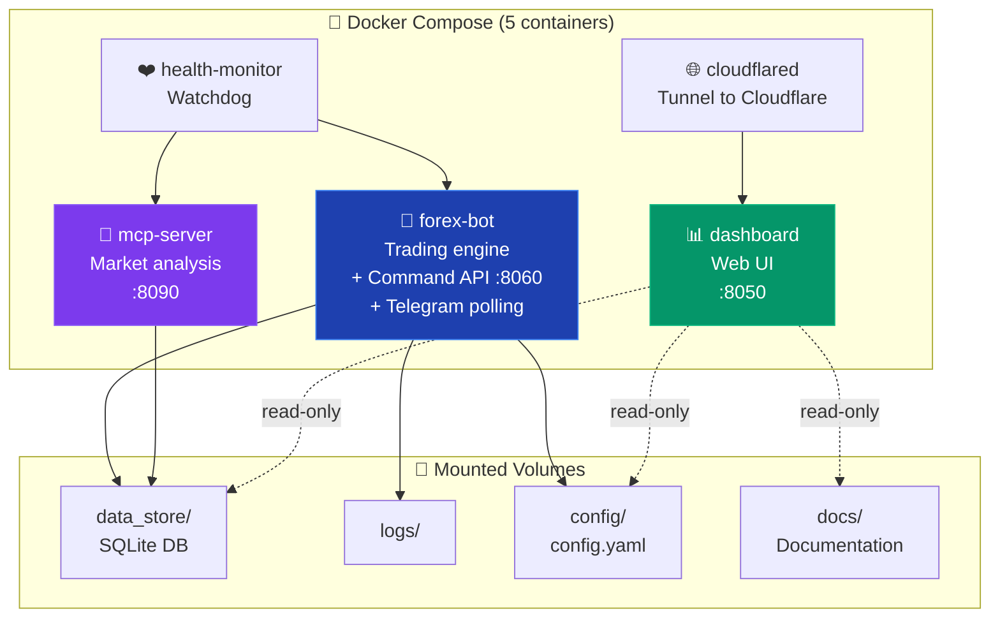
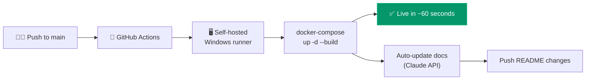
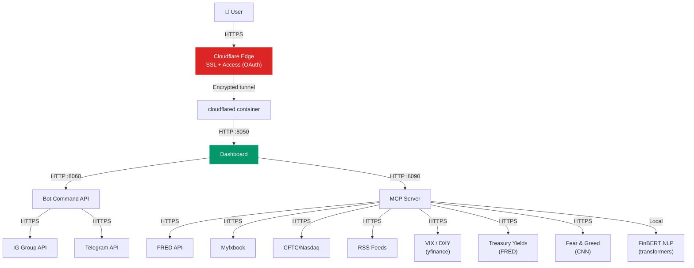

# Infrastructure & Deployment

---

## Container Architecture

## CI/CD Pipeline

## Network Flow

## Environment Variables

### Secrets (GitHub Secrets → docker-compose)
| Variable | Service | Purpose |
|----------|---------|---------|
| `IG_API_KEY` | bot, mcp | IG Group broker API key |
| `IG_USERNAME` / `IG_PASSWORD` | bot, mcp | IG authentication |
| `IG_ACCOUNT_ID` | bot, mcp | IG account identifier |
| `TELEGRAM_BOT_TOKEN` | bot | Trading bot Telegram token |
| `TELEGRAM_BOT_SYS_TOKEN` | bot | System bot Telegram token |
| `TELEGRAM_CHAT_ID` | bot | Your Telegram chat ID |
| `ANTHROPIC_API_KEY` | bot, mcp, dashboard | Claude AI API key |
| `FRED_API_TOKEN` | mcp | FRED macro data API key |
| `DASHBOARD_CMD_TOKEN` | bot, dashboard | Shared auth for command API |
| `CLOUDFLARE_TUNNEL_TOKEN` | cloudflared | Tunnel authentication |
| `GITHUB_PAT` | CI | Push permissions for doc updates |

### Hardcoded Defaults (in docker-compose)
| Variable | Value | Service |
|----------|-------|---------|
| `MCP_SERVER_URL` | `http://mcp-server:8090` | dashboard |
| `BOT_COMMAND_URL` | `http://forex-bot:8060` | dashboard |
| `DB_PATH` | `/app/data_store/trader.db` | dashboard |
| `DOCS_DIR` | `/app/docs` | dashboard |
| `IG_ENVIRONMENT` | `demo` | bot, mcp |

## Database

Single SQLite file (`data_store/trader.db`) with tables:

| Table | Rows (est.) | Purpose |
|-------|------------|---------|
| `trades` | ~200 | Every trade opened/closed |
| `candles` | ~10,000 | OHLCV price data |
| `predictions` | growing | LSTM predictions with outcomes |
| `scan_log` | growing | Full audit of every pair evaluation |
| `model_metrics` | ~10 | LSTM training snapshots |
| `analytics_snapshots` | growing | Rolling performance metrics |
| `daily_plans` | ~30 | Claude AI daily trading plans |
| `overnight_holds` | ~5 | Positions held past EOD |

Current size: **~2.2 MB**. Projected: ~200 MB/year.

## Key Dependencies

| Package | Purpose |
|---------|---------|
| `torch` / `pytorch` | LSTM neural network training and inference |
| `transformers` | FinBERT NLP model for news headline sentiment analysis |
| `fastapi` / `uvicorn` | MCP server and dashboard backend |
| `apscheduler` | Job scheduling (scans, retrains, health audits) |
| `yfinance` | Fallback candle data, VIX, DXY feeds |
| `python-telegram-bot` | Telegram bot integration |
| `anthropic` | Claude AI API for chat and analysis |
| `fredapi` | FRED macro data (interest rates, yield spreads) |

## Scheduled Jobs

| Job | Interval | Description |
|-----|----------|-------------|
| Market scan | Every 3 hours | Evaluate all pairs, place trades |
| Position reconciliation | Every 5 minutes | Sync open positions with broker |
| LSTM retrain | Every 4 hours | Retrain model on fresh data |
| Integrity review | Every 3 hours | Check performance, recommend fixes |
| Deep review | Every 6 hours | Comprehensive performance analysis |
| Health audit | Twice daily (09:00 + 17:00 UTC) | System health checks |
| Outcome resolution | Every 60 minutes | Resolve LSTM prediction outcomes |
| Drift check | Every 30 minutes | LSTM accuracy drift detection |
| Analytics snapshot | Every 60 minutes | Rolling performance metrics |
| EOD evaluation | 23:45 UTC | Re-score open positions |
| EOD close | 23:59 UTC | Force close non-held positions |
| Daily report | 00:05 UTC | Send daily P&L report |
