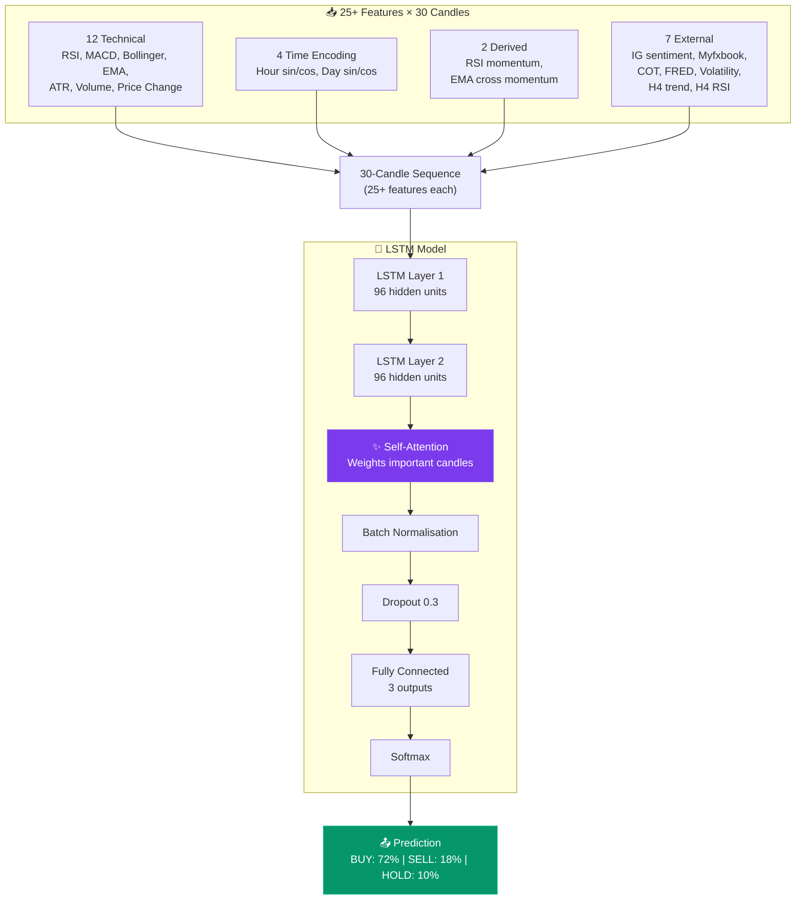
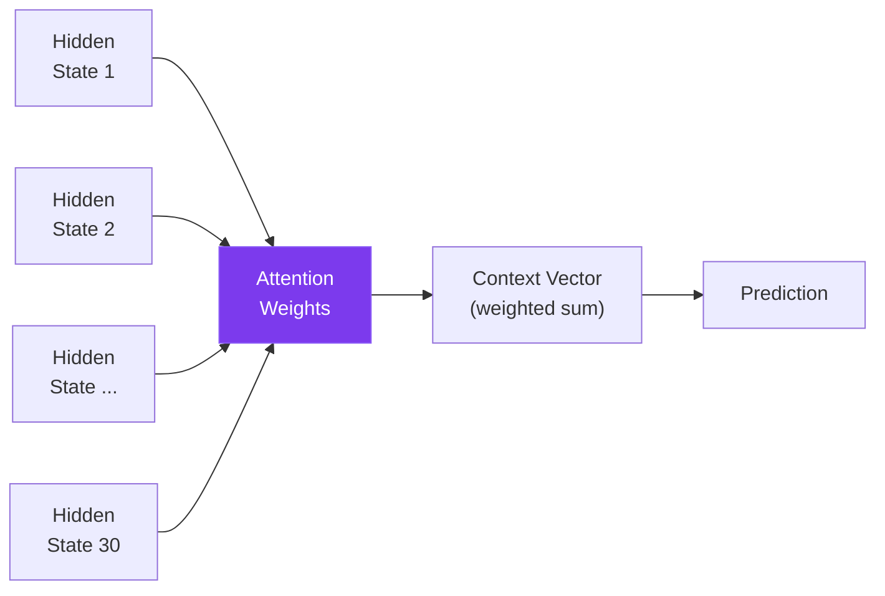
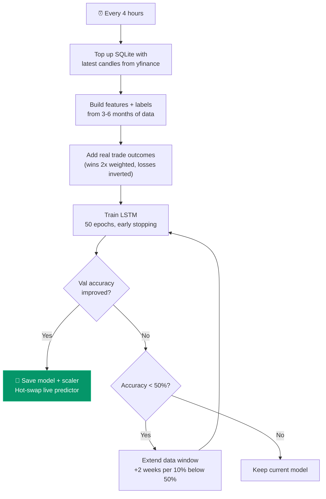

# LSTM Neural Network Engine

The AI brain that predicts market direction. Contributes 50% of every trade decision.

---

## Architecture



## Features (25+ per candle)

### Base Technical (1-12)
| # | Feature | What it measures |
|---|---------|-----------------|
| 1 | close_pct_change | % change from previous close |
| 2 | range_norm | (High-Low) / ATR — candle size relative to volatility |
| 3 | body_norm | (Close-Open) / ATR — bullish/bearish pressure |
| 4 | volume_rel | Volume / 20-period mean — above or below average |
| 5 | rsi_norm | RSI(14) scaled 0-1 — overbought/oversold |
| 6 | macd_hist_norm | MACD histogram / price — momentum strength |
| 7 | bb_percent_b | Bollinger %B — where price sits in the bands |
| 8 | ema20_dist | Distance from EMA(20) — short-term trend |
| 9 | ema50_dist | Distance from EMA(50) — medium-term trend |
| 10 | atr_norm | ATR(14) / price — volatility level |
| 11 | hour_sin | Cyclical hour encoding (sin) |
| 12 | hour_cos | Cyclical hour encoding (cos) |

### Extended (13-18)
| # | Feature | What it measures |
|---|---------|-----------------|
| 13 | day_sin | Cyclical day-of-week encoding (sin) |
| 14 | day_cos | Cyclical day-of-week encoding (cos) |
| 15 | rsi_roc | RSI rate of change — RSI momentum/divergence |
| 16 | macd_signal_dist | MACD vs signal line distance — trend strength |
| 17 | close_vs_range | Where close sits in candle range (0=low, 1=high) |
| 18 | ema_cross_momentum | Rate of change of EMA20-EMA50 gap |

### External Signals (19-25)
| # | Feature | What it measures |
|---|---------|-----------------|
| 19 | ig_sentiment | IG retail positioning (-1 to +1) |
| 20 | myfxbook_sentiment | Myfxbook community positioning (-1 to +1) |
| 21 | cot_bias | Institutional positioning from CFTC (-1 to +1) |
| 22 | fred_rate_diff | Interest rate differential (normalised) |
| 23 | volatility_regime | Market volatility state (0-1 ordinal) |
| 24 | htf_trend | H4 timeframe trend direction (-1/0/+1) |
| 25 | htf_rsi | H4 RSI (normalised 0-1) |

### New External Signals (26-29)
| # | Feature | What it measures |
|---|---------|-----------------|
| 26 | vix_norm | VIX fear index (normalised 0-1) — market risk level |
| 27 | dxy_change | DXY Dollar Index rate of change — USD strength/weakness |
| 28 | yield_spread | Treasury 2Y/10Y yield spread — recession/expansion signal |
| 29 | fear_greed | CNN Fear & Greed Index (normalised 0-1) — market sentiment extreme |

## Self-Attention Mechanism

Standard LSTMs rely heavily on the final hidden state (most recent candle). The self-attention layer lets the model focus on **any candle in the sequence** that's important — e.g., a big spike 15 candles ago that's still affecting the current setup.



## Continuous Training



### Labelling Logic

For each candle, the trainer looks ahead 3 periods:
- **BUY (0)**: Max high exceeds close + 1.0×ATR AND upside > downside
- **SELL (1)**: Min low falls below close - 1.0×ATR AND downside > upside
- **HOLD (2)**: Neither threshold reached

### Trade Outcome Learning

Real trade results are fed back into training:
- **Winning BUY** → reinforced as BUY label (2x sample weight)
- **Winning SELL** → reinforced as SELL label (2x sample weight)
- **Losing BUY** → relabelled as SELL (model learns to avoid this setup)
- **Losing SELL** → relabelled as BUY
- **Breakeven** → labelled as HOLD

## Shadow Mode

When `lstm.shadow_mode: true`, the LSTM generates predictions but doesn't influence trades:

```
EUR_USD SHADOW | LSTM: 72.3% BUY | Indicators: 58.1% BUY | Delta: +14.2pp
```

Both scores are logged. The indicator-only score drives trade decisions. Once LSTM proves it adds value, set `shadow_mode: false` to give it its full 50% weight.

## Model Specs

| Parameter | Value |
|-----------|-------|
| Architecture | 2-layer LSTM + self-attention |
| Hidden units | 96 per layer |
| Input features | 25+ (18 base + 7 external + 4 new external) |
| Sequence length | 30 candles |
| Parameters | ~119,000 |
| Dropout | 0.3 |
| Training epochs | 50 (early stopping at patience 7) |
| Batch size | 64 |
| Learning rate | 0.001 (halved on plateau) |
| Retrain interval | Every 4 hours |
| Data window | 3-6 months (adaptive) |
