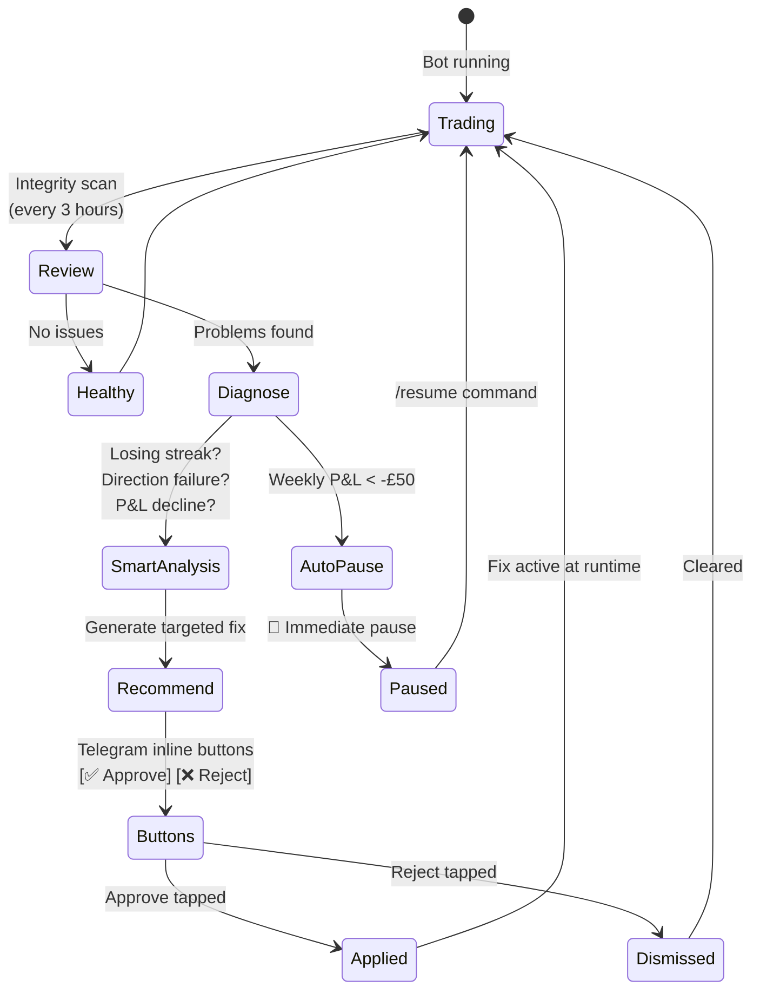
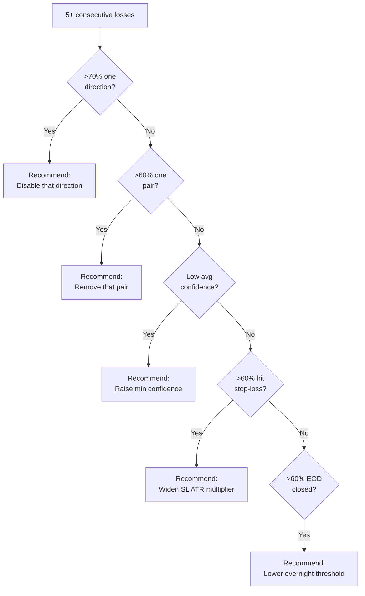

# Automated Remediation System

The bot monitors its own performance and recommends fixes. You approve or reject via Telegram inline buttons or the dashboard.

---

## How It Works

## Detection Methods

### 1. Smart Losing Streak Analysis
Triggered when 5+ consecutive losses occur. Diagnoses the root cause:

### 2. Direction Performance Alert
Checks 7-day win rate per direction (BUY/SELL). If either is below 30% with 5+ trades, recommends disabling it.

### 3. Weekly Strategy Review (Monday 00:15 UTC)
Compares this week vs last week. Flags pairs that flipped from profitable to unprofitable.

### 4. Daily LSTM Health (08:00 UTC)
Checks model age, prediction accuracy, LSTM edge. Recommends shadow mode toggle if accuracy is poor.

### 5. Auto-Pause (Autonomous)
If weekly P&L drops below -£50 — **immediately pauses trading without approval**. The only autonomous action.

### 6. Drawdown Protection
Monitors equity drawdown from peak. When equity drops 5% from its high-water mark:
- Tightens risk per trade (reduces position sizes)
- Raises confidence threshold temporarily
- Alerts via Telegram with drawdown details
- Automatically relaxes when equity recovers

## Action Types

| Type | What it does | Restart needed? |
|------|-------------|-----------------|
| `runtime_config_change` | Changes a config parameter immediately + persists to YAML | No |
| `disable_direction` | Blocks BUY or SELL trades | No |
| `enable_direction` | Re-enables a blocked direction | No |
| `remove_pair` | Removes a pair from scanning | No |
| `pause_trading` | Stops all new trades | No |

## Parameter Caps

The auto-optimiser has hard limits to prevent runaway escalation:

| Parameter | Max value | Why |
|-----------|-----------|-----|
| Min confidence | 95% | Beyond this, nothing trades |
| Trailing stop trail | 2.0× ATR | Wider = profits evaporate |
| Trailing stop activation | 3.0× ATR | Higher = never activates |
| Confidence floor | 70% | Auto-lowering won't go below this |

## Where to Manage

- **Telegram**: Inline buttons on integrity scan messages
- **Dashboard**: Remediation page (Tools → Remediation)
- **Config**: `remediation.auto_approve: true` (currently ON) — remediation actions are applied automatically without manual approval. Set to `false` to require manual approval via Telegram buttons
