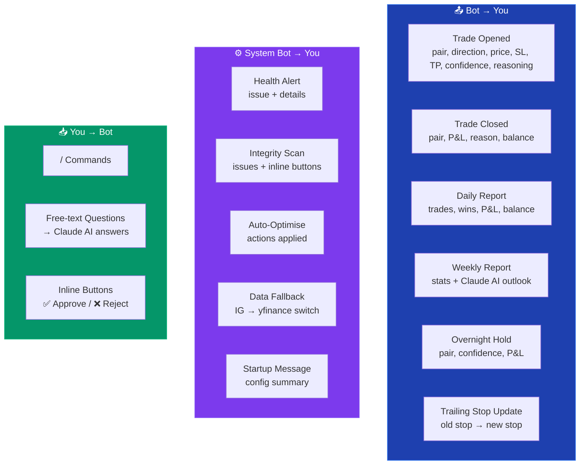

# Telegram Commands

Two Telegram bots keep trading signals and system operations separate:

- **Trading Bot** (`TELEGRAM_BOT_TOKEN`): trade opens/closes, reports, commands
- **System Bot** (`TELEGRAM_BOT_SYS_TOKEN`): health alerts, integrity scans, data source fallbacks

---

## Command Reference

### Positions & Account
| Command | Description |
|---------|-------------|
| `/positions` | Open positions with P&L |
| `/balance` | Account funds, equity, margin, available |
| `/pltoday` | Today's realised + unrealised P&L |
| `/plweek` | This week's running total by pair |
| `/history` | Last 10 closed trades with outcome |
| `/trades` | Recent trades with index numbers |

### Close Commands
| Command | Description |
|---------|-------------|
| `/close <#>` | Close trade by number |
| `/closeall` | Close all open positions |
| `/closepair EURUSD` | Close a specific pair's position |
| `/closeprofitable` | Close all profitable positions |
| `/closelosing` | Close all losing positions |

### Bot Control
| Command | Description |
|---------|-------------|
| `/pause` | Pause trading — no new trades |
| `/resume` | Resume trading after a pause |
| `/status` | Bot health, services, open positions |
| `/report` | Trigger daily report on demand |

### Strategy
| Command | Description |
|---------|-------------|
| `/getconfidence` | Show current confidence threshold (runtime + YAML) |
| `/setconfidence 85` | Change min confidence threshold % |
| `/setrisk 2` | Change risk per trade % |
| `/settings` | Show all current bot settings |

### Analytics & Integrity
| Command | Description |
|---------|-------------|
| `/accuracy` | LSTM prediction accuracy (7d) |
| `/model` | LSTM model info and last retrain |
| `/drift` | Model drift detection status |
| `/performance` | LSTM performance metrics |
| `/integrity` | Full profit integrity check with recommendations |
| `/action <#>` | Apply an integrity recommendation |
| `/discuss <#>` | Discuss a recommendation in detail |

### Deploy
| Command | Description |
|---------|-------------|
| `/deploy` | Trigger CI/CD deployment via GitHub Actions |
| `/deploystatus` | Show last 5 deployment runs |

### Tools
| Command | Description |
|---------|-------------|
| `/today` | Today's summary |
| `/health` | System health check |
| `/plan` | Tomorrow's trading plan |
| `/stats` | All-time performance stats |
| `/datastatus` | IG vs yfinance data source status |
| `/query <question>` | Natural language SQL query |
| `/devops` | Today's git commits |
| `/backtest` | LSTM vs indicator-only simulation |
| `/fallbacktest` | Test yfinance backup |

### Free-Text Questions
Send any message that isn't a command and Claude AI will answer it using your full trade context:
- *"How did EUR/USD do this week?"*
- *"Why did the bot take that last trade?"*
- *"What's my win rate?"*

---

## Message Flow



---

## Inline Buttons (Remediation)

When the integrity monitor detects issues, it sends recommendations with inline buttons:

```
🔍 INTEGRITY SCAN
Status: ⚠️ WARNING

⚠️ SELL win rate: 15% (1W/5L in 7d)

💡 #3 — Disable SELL trades

[✅ Approve #3] [❌ Reject #3]
```

Tapping **Approve** applies the fix immediately at runtime (no restart). Tapping **Reject** dismisses it.
