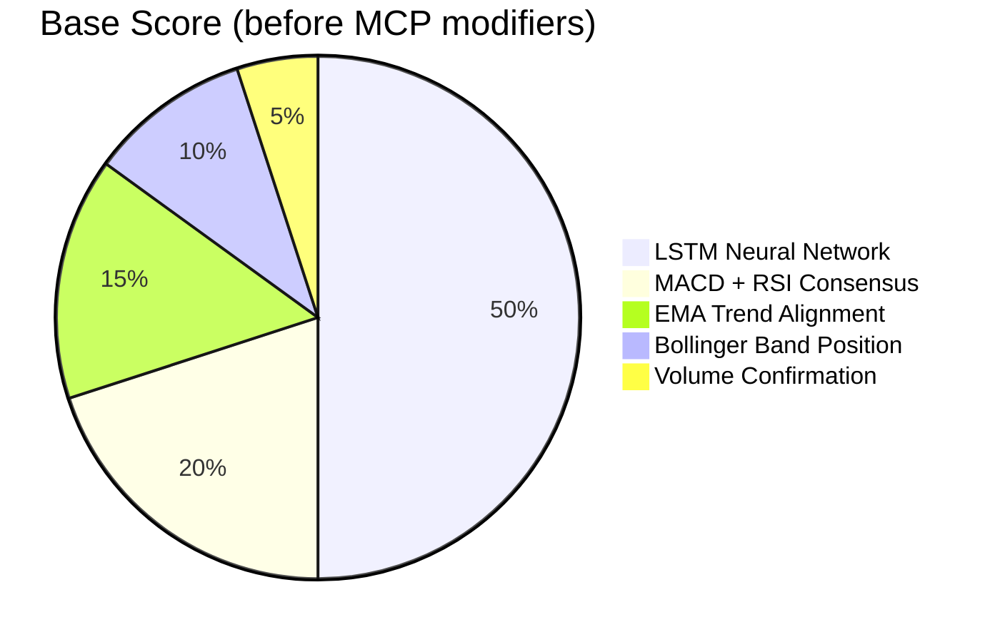
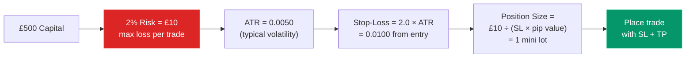
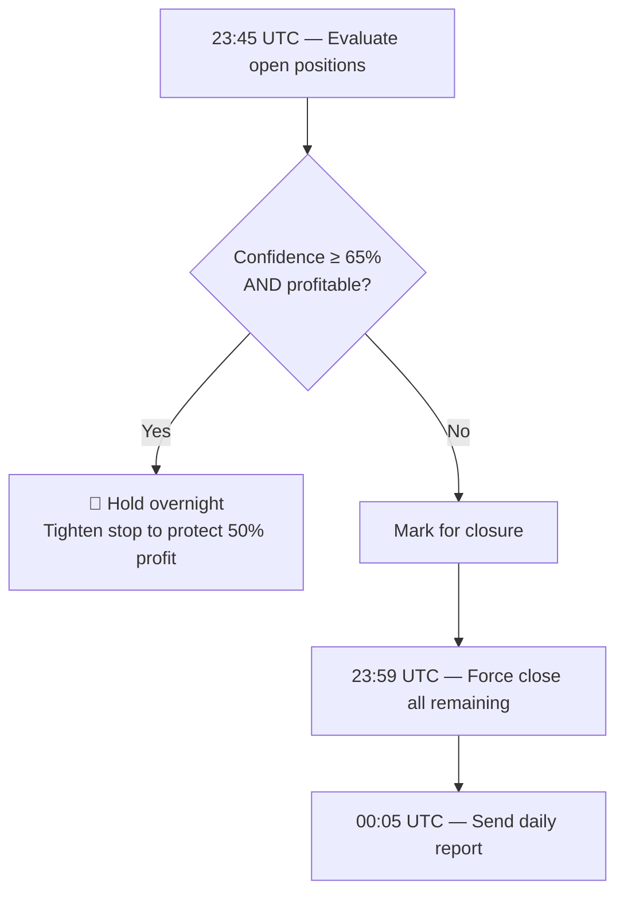

# Trading Logic

How the bot decides when and what to trade.

---

## Decision Pipeline

Every 3 hours, each of the 10 currency pairs goes through this pipeline:

```mermaid
flowchart TD
    SCAN["⏰ Scan Triggered"] --> DISABLED{"Pair disabled<br/>by remediation?"}
    DISABLED -->|Yes| SKIP_PAIR["⏭️ Skip pair"]
    DISABLED -->|No| CANDLES["📊 Fetch 60 H1 candles<br/>from IG (cached, top-up 3)"]

    CANDLES --> TECH["📐 Technical Indicators<br/>RSI, MACD, BB, EMA, ATR, Volume"]
    TECH --> LSTM["🧠 LSTM Prediction<br/>25 features → BUY/SELL/HOLD"]
    LSTM --> MCP["🔬 MCP Context<br/>9 external data sources"]
    MCP --> SCORE["⚖️ Confidence Score<br/>0-100% weighted composite"]

    SCORE --> THRESHOLD{"Score ≥ 85%?"}
    THRESHOLD -->|No| SKIP_CONF["⏭️ Skip — low confidence"]
    THRESHOLD -->|Yes| DIR_CHECK{"Direction<br/>disabled?"}
    DIR_CHECK -->|Yes| SKIP_DIR["⏭️ Skip — direction blocked"]
    DIR_CHECK -->|No| CORR{"Correlated pair<br/>already open?"}
    CORR -->|Yes| SKIP_CORR["⏭️ Skip — correlation risk"]
    CORR -->|No| SIZE["📏 Position Sizing"]

    SIZE --> TRADE["💰 Place Trade on IG"]
    TRADE --> NOTIFY["📱 Telegram Alert"]
    TRADE --> LOG["📝 Save to DB + Scan Log"]

    SKIP_PAIR & SKIP_CONF & SKIP_DIR & SKIP_CORR --> AUDIT["📝 Log skip reason<br/>to Scan Audit"]

    style TRADE fill:#059669,stroke:#10b981,color:#fff
    style SCORE fill:#7c3aed,stroke:#8b5cf6,color:#fff
```

## Confidence Score Components

## MCP Context Modifiers

Applied after the base score. Can push the score up or down:

| Signal | Source | Boost | Penalty |
|--------|--------|-------|---------|
| Economic Calendar | RSS feeds | — | -15 (high-impact event within 2h) |
| News Sentiment | FX Street, ForexLive, Investing.com | +8 (aligned) | -10 (opposed) |
| IG Client Sentiment | IG API (contrarian) | +8 (against crowd) | -10 (with crowd) |
| Myfxbook Sentiment | Myfxbook (contrarian) | +5 (against crowd) | -5 (with crowd) |
| FRED Macro | Interest rate differentials | +5 (carry trade) | -5 (against carry) |
| CFTC COT | Institutional positioning | +5 (with institutions) | -8 (against) |
| Volatility Regime | ATR ratio analysis | +5 (low/calm) | -15 (extreme) |
| Session Performance | Historical pair/session data | +5 (good session) | -5 (bad session) |
| Correlation Risk | Position overlap check | — | -10 (correlated open) |

## Position Sizing

## Confidence-Tiered Risk

Higher confidence trades get slightly different risk parameters:

| Tier | Confidence | Risk % | SL (ATR) | TP Ratio | Trail |
|------|-----------|--------|----------|----------|-------|
| Low | 50-65% | 1% | 2.5x | 2.0:1 | 1.5x |
| Medium | 66-80% | 2% | 2.0x | 2.0:1 | 1.5x |
| High | 81%+ | 2% | 2.0x | 2.5:1 | 1.5x |

## End of Day

## Session-Aware Trading

The minimum confidence threshold adjusts based on the forex session:

| Session | Hours (UTC) | Confidence Adjustment |
|---------|-------------|----------------------|
| London/NY Overlap | 13:00-17:00 | -5 (best conditions) |
| London | 08:00-17:00 | 0 (standard) |
| New York | 13:00-22:00 | 0 (standard) |
| Tokyo | 00:00-09:00 | +10 (raise bar) |
| Sydney | 22:00-07:00 | +15 (quietest session) |

JPY pairs are exempt from the Tokyo penalty (they're most active then).
