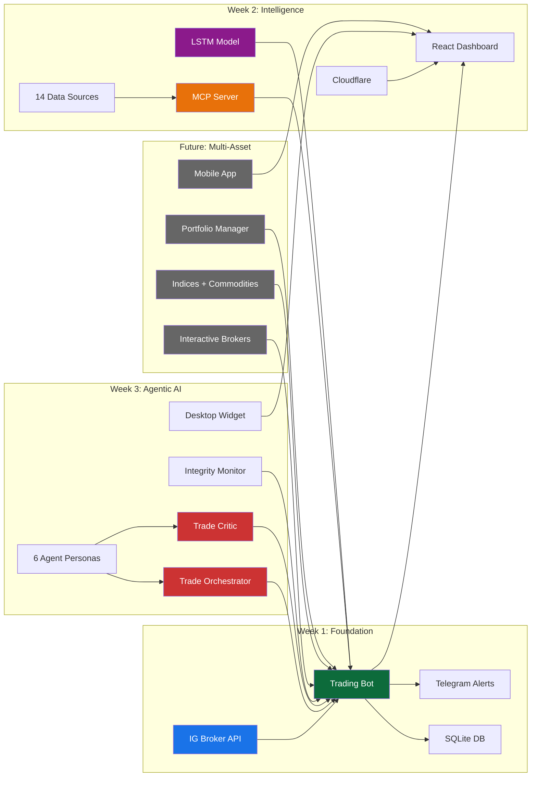

# Project Roadmap

The AI Trader Bot journey — from concept to a multi-agent agentic AI trading system in 18 days, and what's coming next.

```mermaid
timeline
    title AI Trader Bot — Project Timeline

    section Concept & Genesis
        Jan-Feb 2026 : Idea forms
                     : Joseph researches algo trading
                     : IG Group demo account opened
                     : Architecture designed

    section Week 1 — Foundation (Mar 10-14)
        Mar 10 : Initial commit
               : IG Group broker integration
               : Docker containerisation
               : CI/CD via GitHub Actions
        Mar 11 : Telegram notifications
               : Trade open/close alerts
               : Health monitoring
        Mar 12 : yfinance fallback data source
               : SQLite database (replacing JSON)
               : Candle persistence layer
        Mar 13 : LSTM neural network v1
               : Real-time Lightstreamer streaming
               : Trailing stops + circuit breaker
               : Correlation blocking
               : Session-aware trading
               : Multi-timeframe analysis
        Mar 14 : LSTM v2 — self-attention architecture
               : Prediction tracking + drift detection
               : Dual Telegram bots (trading + system)
               : React dashboard + FastAPI backend
               : Cloudflare Tunnel + HTTPS

    section Week 2 — Intelligence (Mar 15-22)
        Mar 15-16 : MCP analysis server
                  : Economic calendar integration
                  : Client sentiment (IG)
                  : Dashboard polish + mobile
        Mar 17 : Demo trading goes LIVE
               : First real trades on IG demo
               : £10,000 virtual capital
        Mar 21 : FRED macro data (interest rates)
               : Myfxbook community sentiment
               : CFTC COT institutional positioning
               : What-if trade simulator
               : Integrity monitoring system
        Mar 22 : Auto-remediation with Telegram buttons
               : LSTM feedback loop — learns from outcomes
               : MCP signals fed into LSTM features
               : Scan audit log for every decision

    section Week 3 — Refinement (Mar 23-28)
        Mar 23-24 : P&L calendar page
                  : Drawdown protection
                  : Performance benchmarking
                  : Daily profit target (£20)
                  : Mermaid diagrams in dashboard wiki
        Mar 26 : VIX, DXY, yield spreads, Fear & Greed
               : FinBERT NLP news sentiment
               : Health audits (twice daily)
               : Daily strategy review via Claude
               : Guest mode (read-only dashboard)
               : Trading simulator game
               : Sleep-time profit protection
        Mar 27 : Desktop P&L widget (tkinter)
               : Scan interval fix (180min → 15min)
               : Performance analysis (5.3% win rate)
        Mar 28 : 4 trading fixes (P&L recording, stop floors, cooldowns, confidence)
               : Integrity scan spam fix
               : Plain-English reports
               : 12h auto-expiry on config changes
               : 6 agent persona instructions
               : Trade Orchestrator + Critic wired into pipeline

    section Future — Q2 2026
        Apr 2026 : Persona-driven trade decisions mature
                 : Currency strength meter
                 : Seasonality patterns from trade history
                 : Forex Factory calendar integration
        May 2026 : Multi-asset framework
                 : Index trading (FTSE, S&P 500, DAX)
                 : Commodities (Gold, Oil)
                 : Automated database backups

    section Future — H2 2026
        Q3 2026 : Interactive Brokers integration
                : Multi-broker order routing
                : Portfolio management per asset class
                : Cloud hosting for 24/7 uptime
        Q4 2026 : Real account transition
                : Advanced ML ensemble models
                : Social trading / signal sharing
                : Mobile companion app
                : Regulatory compliance tools
```

## Architecture Evolution

## Key Statistics (as of March 28, 2026)

| Metric | Value |
|--------|-------|
| Days since first commit | 18 |
| Total commits | ~180 |
| Pull requests | 72 |
| Python modules | 30+ |
| Data sources | 14 |
| AI agent personas | 6 |
| Telegram commands | 20+ |
| Dashboard pages | 15+ |
| LSTM features | 18 |
| Lines of code | ~15,000+ |

## Phase Definitions

| Phase | Dates | Focus | Status |
|-------|-------|-------|--------|
| Foundation | Mar 10-14 | Core trading, broker, DB, CI/CD | Done |
| Intelligence | Mar 15-22 | LSTM, MCP, sentiment, dashboard | Done |
| Refinement | Mar 23-28 | Risk management, agentic AI, performance | Done |
| Multi-Asset | Apr-May 2026 | Indices, commodities, new signals | Planned |
| Scale | Q3-Q4 2026 | Multi-broker, cloud hosting, real account | Planned |
